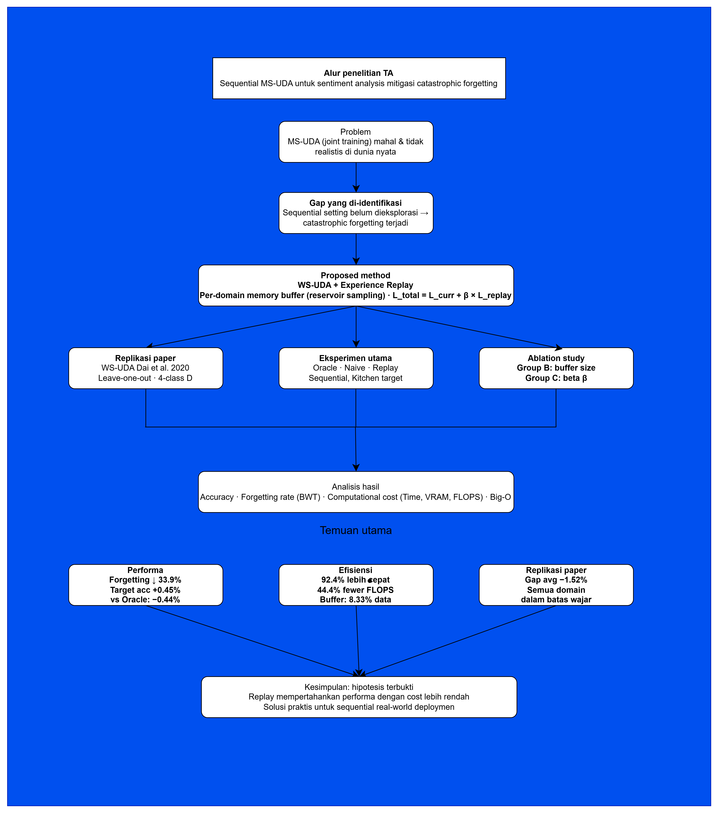

# Mitigasi Catastrophic Forgetting pada Sequential Multi-Source Domain Adaptation untuk Analisis Sentimen Menggunakan Metode Experience Replay


**Syarif Sanad** — 5025221257  
Teknik Informatika, Institut Teknologi Sepuluh Nopember (ITS) Surabaya  
Dosen Pembimbing: Prof. Ir. Ary Mazharuddin Shiddiqi, S.Kom., M.Comp.Sc., Ph.D., IPM.  
GitHub: [k08e24bryant/TA_ContinualLearning_ExperienceReplay](https://github.com/k08e24bryant/TA_ContinualLearning_ExperienceReplay)

---

## Big Picture



---

## Latar Belakang dan Motivasi

Penelitian ini berangkat dari satu masalah praktis: algoritma MS-UDA (Multi-Source Unsupervised Domain Adaptation) dalam setting aslinya termasuk WS-UDA yang dipublikasikan Dai et al. (2020) membutuhkan semua data domain tersedia dan diproses secara bersamaan (*joint training*). Ini membuat computational cost-nya tinggi dan tidak realistis untuk deployment di dunia nyata, di mana data dari domain baru datang secara bertahap dari waktu ke waktu.

Dari situ muncul pertanyaan: apakah ada cara untuk menjalankan MS-UDA secara sequential domain datang satu per satu dengan computational cost yang lebih rendah, tanpa mengorbankan performa secara signifikan?

Salah satu alternatif yang dieksplorasi adalah **memory replay**: menyimpan sebagian kecil sampel dari domain lama ke dalam buffer memori, lalu memutarnya kembali saat melatih domain baru. Pendekatan ini dipilih karena bersifat adaptive (ukuran buffer bisa disesuaikan), tidak membutuhkan akses ke semua data historis, dan secara teori memiliki computational cost yang lebih ringan dibandingkan joint training.

Sebelum diimplementasikan, klaim ini diverifikasi terlebih dahulu melalui **analisis Big-O** untuk memastikan bahwa computational cost memory replay memang lebih kecil dari MS-UDA asli. Hasilnya:

| Metode | Time Complexity | GFLOPS Empiris | Training Time |
|---|---|---|---|
| WS-UDA Paper (LOO ×4) | O(N×K×E×nc) × (K+1) runs | 60,238 | 27.92 menit |
| Oracle (Joint Training) | O(N×K×E×nc) | 23,469 | 29.53 menit |
| Experience Replay | O((N+B)×K×E_s×nc) | 13,038 | 3.91 menit |
| Naive Sequential | O(N×K×E_s×nc) | 7,823 | 2.66 menit |

Terbukti bahwa Experience Replay memiliki computational cost yang jauh lebih rendah dari Oracle maupun WS-UDA paper **92.4% lebih cepat dari Oracle** dan **91.9% lebih cepat dari WS-UDA Paper** dengan hanya menyimpan **8.33% dari total data** di buffer.

---

## Hipotesis

Dengan computational cost yang lebih rendah, Experience Replay tetap dapat mempertahankan performa domain adaptation pada konteks Sentiment Analysis performa tidak turun secara signifikan dibandingkan joint training, atau bahkan bisa melebihinya.

---

## Pembuktian Hipotesis

Hipotesis dibuktikan melalui eksperimen menggunakan **dataset yang sama dengan paper WS-UDA** Amazon Review Benchmark (Blitzer et al. 2007) dengan empat domain: Books, DVD, Electronics, dan Kitchen. Tiga metode dibandingkan dalam satu setting yang konsisten:

**Oracle** merepresentasikan joint training (upper bound) semua domain dilatih sekaligus, tidak mungkin forgetting. Ini adalah patokan performa terbaik.

**Naive Sequential** membuktikan bahwa forgetting memang terjadi ketika WS-UDA dijalankan secara sequential tanpa mitigasi apapun ini lower bound yang menunjukkan masalah nyata ada.

**Experience Replay** adalah metode yang diusulkan sequential seperti Naive, tapi ditambah buffer memori yang diputar ulang saat training.

### Hasil Eksperimen Utama

| Method | Books (%) | DVD (%) | Electronics (%) | Kitchen (%) | Avg Src (%) | Avg Forget (%) | Time (min) |
|---|---|---|---|---|---|---|---|
| Oracle (Upper Bound) | 94.90 | 95.05 | 94.50 | 84.70 | 94.82 | N/A | 29.53 |
| Naive Sequential (Lower Bound) | 96.00 | 94.90 | 97.40 | 84.90 | 96.10 | 3.475 | 2.66 |
| **Experience Replay (Proposed)** | **95.40** | **94.65** | **93.10** | **85.15** | **94.38** | **2.30** | **3.91** |

Hasilnya menjawab hipotesis dengan jelas:

- Forgetting turun **33.9%** (3.48% → 2.30%) mitigasi berhasil
- DVD forgetting **eliminasi 100%** (2.95% → 0.00%)
- Target accuracy Replay **85.15% melampaui Oracle 84.70%** (+0.45%)
- Selisih Replay vs Oracle hanya **−0.44%** pada avg source accuracy tidak turun signifikan
- Replay **92.4% lebih cepat** dari Oracle dengan hanya **8.33% data tersimpan**

Hipotesis **terbukti**.

---

## Perbandingan dengan WS-UDA Paper (Replikasi)

Untuk memvalidasi implementasi dan memberikan konteks perbandingan yang lebih lengkap, dilakukan replikasi WS-UDA paper asli (Dai et al. 2020) dengan setting exact: multi-class discriminator (4 kelas), leave-one-out evaluation, dan unlabeled target ikut adversarial training.

### Apa itu Leave-One-Out?

Paper asli menjalankan **4 eksperimen terpisah** setiap domain pernah menjadi target sekali:

```
Run 1: Books    = target  | source: DVD, Electronics, Kitchen
Run 2: DVD      = target  | source: Books, Electronics, Kitchen
Run 3: Electronics = target | source: Books, DVD, Kitchen
Run 4: Kitchen  = target  | source: Books, DVD, Electronics
```

Sedangkan TA ini menggunakan **Kitchen sebagai fixed target** karena fokusnya adalah sequential learning, bukan cross-domain evaluation.

### Hasil Replikasi vs Paper Asli

| Target Domain | Paper Acc (%) | Replikasi (%) | Gap (%) | Status |
|---|---|---|---|---|
| Books | 79.39 | 78.90 | −0.49 | Within range |
| DVD | 80.14 | 78.90 | −1.24 | Within range |
| Electronics | 83.81 | 81.80 | −2.01 | Acceptable |
| Kitchen | 87.66 | 85.30 | −2.36 | Acceptable |
| **Average** | **82.75** | **81.23** | **−1.52** | ** Successful** |

Gap −1.52% dalam batas wajar dan dapat dijelaskan oleh perbedaan ukuran unlabeled pool, random seed yang tidak dispesifikasi di paper, dan strategi val/test split yang berbeda.

### Perbedaan Setting Paper vs TA Ini

| Aspek | Paper WS-UDA | TA Sequential |
|---|---|---|
| Training mode | Joint (semua sekaligus) | Sequential (satu per satu) |
| Discriminator | Multi-class (4 kelas) | Binary (source vs target) |
| Evaluation | Leave-one-out (4 run) | Fixed target Kitchen |
| Target data | Ikut adversarial training | Tidak dipakai saat training |
| Catastrophic forgetting | Tidak mungkin | Terjadi → dimitigasi |
| Computational cost | 60,238 GFLOPS (4 run) | 13,038 GFLOPS (1 run) |

Perbandingan ini tidak bisa dilakukan secara langsung (apple-to-apple) karena setting-nya fundamental berbeda. Paper WS-UDA mengukur kemampuan adaptasi dari berbagai source ke target. TA ini mengukur kemampuan mempertahankan pengetahuan saat domain datang secara sequential.

---

## Ablation Study

Ablation study dilakukan untuk menemukan konfigurasi optimal Experience Replay.

### Group B — Variasi Buffer Size (Beta = 1.0)

| Run | Buffer | Avg Src (%) | Kitchen (%) | Avg Forget (%) | Time (min) |
|---|---|---|---|---|---|
| B1 | 100 | 95.28 | 83.10 | 2.25 | 2.91 |
| B2 | 300 | 94.33 | 85.25 | 3.00 | 3.01 |
| **B3 (baseline)** | **500** | 93.62 | 84.40 | 2.48 | 3.23 |
| B4 | 1000 | 94.12 | 84.30 | 2.23 | 3.89 |
| B5 | 2000 | 94.30 | 83.85 | 2.15 | 3.05 |

### Group C — Variasi Beta (Buffer = 500)

| Run | Beta | Avg Src (%) | Kitchen (%) | Avg Forget (%) | Time (min) |
|---|---|---|---|---|---|
| C1 | 0.1 | 93.23 | 82.75 | 2.43 | 3.00 |
| C2 | 0.5 | 94.23 | 83.15 | 2.80 | 3.22 |
| **C3 (baseline)** | **1.0** | **94.45** | **84.65** | **2.35** | 3.09 |
| C4 | 2.0 | 93.13 | 83.50 | 2.60 | 3.05 |
| C5 | 5.0 | 95.07 | 84.65 | 2.90 | 3.12 |

### Group D — Best Combination

| Run | Buffer | Beta | Avg Src (%) | Kitchen (%) | Avg Forget (%) | vs Proposed |
|---|---|---|---|---|---|---|
| D1 | 300 | 1.0 | 95.27 | 84.40 | 2.375 | Src+0.89% Tgt−0.75% |
| D2 | 1000 | 1.0 | 94.22 | 84.65 | 2.95 | Src−0.16% Tgt−0.50% |
| D3 | 2000 | 1.0 | 94.32 | 83.60 | 2.45 | Src−0.06% Tgt−1.55% |
| **Proposed** | **500** | **1.0** | **94.38** | **85.15** | **2.30** | ** BEST** |

Buffer=500 terkonfirmasi sebagai **sweet spot**. Group D tidak menemukan kombinasi yang lebih baik dari proposed method ini memvalidasi pilihan hyperparameter yang digunakan.

---

## Version Tracking

### v1 Baseline Implementation
WS-UDA sequential tanpa mitigasi. Membuktikan catastrophic forgetting terjadi. Forgetting rate: **3.48%**. File: `train_naive.py`.

### v2 Experience Replay Basic
WS-UDA + per-domain replay buffer (500 slots, reservoir sampling, β=1.0). Forgetting turun ke **2.30%**. Bug domain_id_offset ditemukan dan diperbaiki — forgetting turun dari 14.62% ke 2.30% setelah fix. File: `train_replay.py`, `replay_buffer.py`.

### v3 Full Evaluation + Ablation
Replikasi paper WS-UDA (leave-one-out, multi-class discriminator). Ablation study Group B (buffer size), Group C (beta), Group D (best combination). Complexity analysis Big-O teoritis + empiris. File: `train_wsuda_paper.py`, `train_ablation.py`, `run_all_experiments.py`, `complexity_analysis.py`.

---

